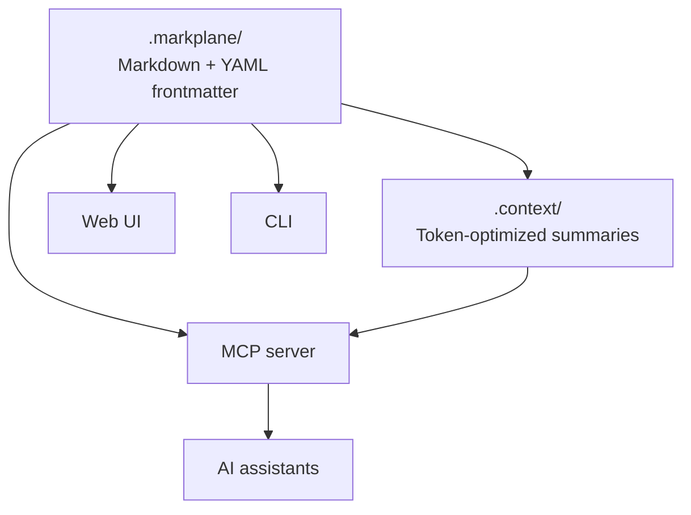

<p align="center">
  <picture>
    <source media="(prefers-color-scheme: dark)" srcset="assets/logo-dark.png">
    <source media="(prefers-color-scheme: light)" srcset="assets/logo-light.png">
    
  </picture>
</p>

<p align="center">
  AI-native, markdown-first project management. Your repo is the project manager.
</p>

<p align="center">
  <a href="https://github.com/zerowand01/markplane/releases"></a>
  <a href="LICENSE"></a>
  <a href="https://github.com/zerowand01/markplane/stargazers"></a>
  
</p>

---

<a href="https://github.com/user-attachments/assets/9d303e13-d14a-458f-bb58-20cd069082bc">
  <video src="https://github.com/user-attachments/assets/9d303e13-d14a-458f-bb58-20cd069082bc" autoplay loop muted playsinline></video>
</a>

Project management that lives in your repo and speaks AI natively.

Every developer using AI coding assistants hits the same wall: the AI is great at code, but clueless about the project. It doesn't know what you're building, what's blocked, or what's next. Meanwhile, your project data is locked in a SaaS tool that lives outside your codebase, outside your editor, outside your flow.

Markplane stores every task, epic, and plan as a markdown file inside your repo — version-controlled with git, browsable with any editor, and automatically compressed into token-efficient summaries your AI assistant can read and act on. No database, no SaaS, no context-switching.

## Who is Markplane for?

Markplane is for developers and small teams who:
- live in Git + PRs,
- use AI coding assistants (Claude Code, Cursor, Copilot, etc.),
- want project context and task state to be *local, versioned, and accessible to your AI* — right alongside the code.

If you want your repo to be the project manager — Markplane is it.

## The 2-minute path to value

1. Install `markplane` ([see below](#installation))
2. Initialize in your project: `markplane init --name "My Project"` ([details](#initialization))
3. Open the web UI: `markplane serve --open`
4. Connect your AI via MCP ([setup guide](docs/mcp-setup.md))
5. Just tell your AI what to do in plain English: *"Create a task for the login bug, mark it critical, and link it to the auth epic."*

## Why Markplane

- **AI-native, not AI-retrofitted** — `.context/` summaries compress full project state into ~1000 tokens. Your AI loads only what it needs. Every design decision optimizes for LLM context windows.
- **Files are the database** — No vendor, no subscription, no migration. `grep` your tasks. `git blame` your status changes. Branch your backlog like you branch your code.
- **MCP server built in** — AI assistants don't just read your project — they manage it. Query tasks, update status, create plans, and track dependencies without leaving your conversation.
- **Zero infrastructure** — `markplane init` and you're done. No signup, no server, no Docker container. It's a single binary.

## Architecture



## Installation

### Homebrew (macOS and Linux)

```bash
brew install zerowand01/markplane/markplane
```

### Shell script (macOS and Linux)

```bash
curl -fsSL https://raw.githubusercontent.com/zerowand01/markplane/master/install.sh | sh
```

Downloads the latest release, verifies the SHA256 checksum, and installs to `~/.local/bin/`. Customize with environment variables:

```bash
curl -fsSL https://raw.githubusercontent.com/zerowand01/markplane/master/install.sh | INSTALL_DIR=/usr/local/bin sh
```

### Pre-built binary

Download the latest release for your platform from [GitHub Releases](https://github.com/zerowand01/markplane/releases). Pre-built binaries include the web UI and require no additional dependencies.

| Platform | Archive |
|----------|---------|
| macOS (Apple Silicon) | `markplane-v*-aarch64-apple-darwin.tar.gz` |
| macOS (Intel) | `markplane-v*-x86_64-apple-darwin.tar.gz` |
| Linux (x86_64) | `markplane-v*-x86_64-unknown-linux-musl.tar.gz` |
| Windows (x86_64) | `markplane-v*-x86_64-pc-windows-msvc.zip` |

**macOS / Linux:**

```bash
tar xzf markplane-v*.tar.gz       # extract the binary from the archive
mv markplane ~/.local/bin/        # or /usr/local/bin/ with sudo
```

> **Note:** On macOS, binaries downloaded via a browser may be blocked by Gatekeeper. Remove the quarantine attribute with `xattr -d com.apple.quarantine ~/.local/bin/markplane`, or use the shell script install which avoids this entirely.

**Windows:** Extract `markplane.exe` from the `.zip` to a location on your `PATH` (e.g., `%LOCALAPPDATA%\markplane\`).

### Build from source

Requires Rust 1.93.0+. To include the web UI, also requires Node.js 18+.

```bash
git clone https://github.com/zerowand01/markplane.git
cd markplane

# CLI only
cargo install --path crates/markplane-cli

# CLI + Web UI (single binary)
cd crates/markplane-web/ui && npm install && npm run build && cd ../../..
cargo install --path crates/markplane-cli --features embed-ui
```

## Initialization

Initialize Markplane in your project:

```bash
markplane init --name "My Project"
```

This creates the `.markplane/` directory with config, templates, and starter content to explore. Use `markplane init --empty` to skip starter content.

```
.markplane/
├── config.yaml           # Project settings
├── INDEX.md              # Root navigation
├── roadmap/              # Epics — strategic goals and phases (EPIC-xxxxx)
├── backlog/              # Tasks — the "what" to do (TASK-xxxxx)
├── plans/                # Plans — the "how" to do it (PLAN-xxxxx)
├── notes/                # Notes — research, ideas, decisions (NOTE-xxxxx)
├── templates/            # Document templates
└── .context/             # AI-generated summaries
```

## Web UI

Launch the local web dashboard to see your project:

```bash
markplane serve --open
```

This opens `http://localhost:4200` in your browser with a dashboard, kanban board, dependency graph, and more.

See the [Web UI Guide](docs/web-ui-guide.md) for keyboard shortcuts, views, and details.

## AI Integration

Markplane includes a built-in [MCP](https://modelcontextprotocol.io) server that lets AI coding assistants manage your project directly. Connect your assistant, then just tell it what to do in natural language — "create a task for the login bug", "show me what's blocked", "mark TASK-fq2x8 as done".

Example with Claude Code:

**Per-user** — adds Markplane to your local editor configuration:

```bash
claude mcp add --transport stdio markplane -- markplane mcp
```

**Project-wide** — add a `.mcp.json` file at the repo root so every team member gets the integration automatically:

```json
{
  "mcpServers": {
    "markplane": {
      "command": "markplane",
      "args": ["mcp"]
    }
  }
}
```

See the [MCP Setup Guide](docs/mcp-setup.md) for other editors, configuration options, and the full tool and resource catalog.

## CLI

The CLI is a power-user interface for everything Markplane can do:

```bash
markplane add "Fix login redirect" --type bug --priority critical --tags auth
markplane ls                          # List tasks
markplane ls --priority high,critical # Filter by priority
markplane show TASK-fq2x8            # View item details
markplane start TASK-fq2x8           # Set to in-progress
markplane done TASK-fq2x8            # Mark as done
markplane dashboard                   # Project overview
markplane sync                        # Regenerate INDEX.md + .context/
markplane check                       # Validate cross-references
```

See the [CLI Reference](docs/cli-reference.md) for complete command documentation.

## Status Workflows

| Type | Statuses | Configurable? |
|------|----------|---------------|
| Task | `draft` → `backlog` → `planned` → `in-progress` → `done` (also `cancelled`) | Yes — via `config.yaml` `workflows.task` |
| Epic | `later` → `next` → `now` → `done` | No |
| Plan | `draft` → `approved` → `in-progress` → `done` | No |
| Note | `draft` → `active` → `archived` | No |

Task statuses are fully configurable. Each status maps to one of six **status categories** (`draft`, `backlog`, `planned`, `active`, `completed`, `cancelled`) that control system behavior (kanban columns, progress tracking, archive eligibility). Add custom statuses like `in-review`, `in-qa`, or `deployed` by placing them under the appropriate category in `config.yaml`.

## Features

- **Markdown + YAML frontmatter** — Structured metadata (status, priority, effort, tags) in YAML; free-form details in markdown.
- **AI-optimized context layer** — Generated `.context/` summaries compress full project state into ~1000 tokens for AI consumption. INDEX.md routing lets AI agents load only what they need.
- **Web UI** — Local dashboard with kanban board, dependency graph, markdown rendering, search, and dark/light themes.
- **MCP server** — Structured tool access for AI coding assistants (Claude, Cursor, etc.) via JSON-RPC over stdio.
- **Cross-references** — `[[TASK-rm6d3]]` wiki-style links between items, with validation via `markplane check`.
- **Dependency tracking** — `blocks` / `depends_on` relationships and bidirectional `related` links with visual dependency graphs.
- **Real-time sync** — Changes from CLI, MCP, or file edits appear instantly in the web UI via WebSocket.
- **Archive management** — Archive completed items across all entity types with easy restore.
- **Built-in workflows** — Configurable status progressions for tasks, epics, plans, and notes.

## Documentation

- [Getting Started Guide](docs/getting-started.md) — Step-by-step tutorial
- [CLI Reference](docs/cli-reference.md) — Complete command documentation
- [Web UI Guide](docs/web-ui-guide.md) — Web dashboard usage and development
- [AI Integration Guide](docs/ai-integration.md) — Context layer, INDEX.md pattern, AI workflows
- [MCP Setup Guide](docs/mcp-setup.md) — AI tool integration
- [Item Reference](docs/file-format.md) — Directory structure, YAML schema, ID system, cross-references

## Development

See [CONTRIBUTING.md](CONTRIBUTING.md) for development setup and contribution guidelines.

- [Architecture](docs/architecture.md) — System design, data model, crate responsibilities
- [Releasing](docs/releasing.md) — Release process and versioning

## License

Apache-2.0. See [LICENSE](LICENSE) for details.

---

<sub>© 2026 zeroWand LLC</sub>
